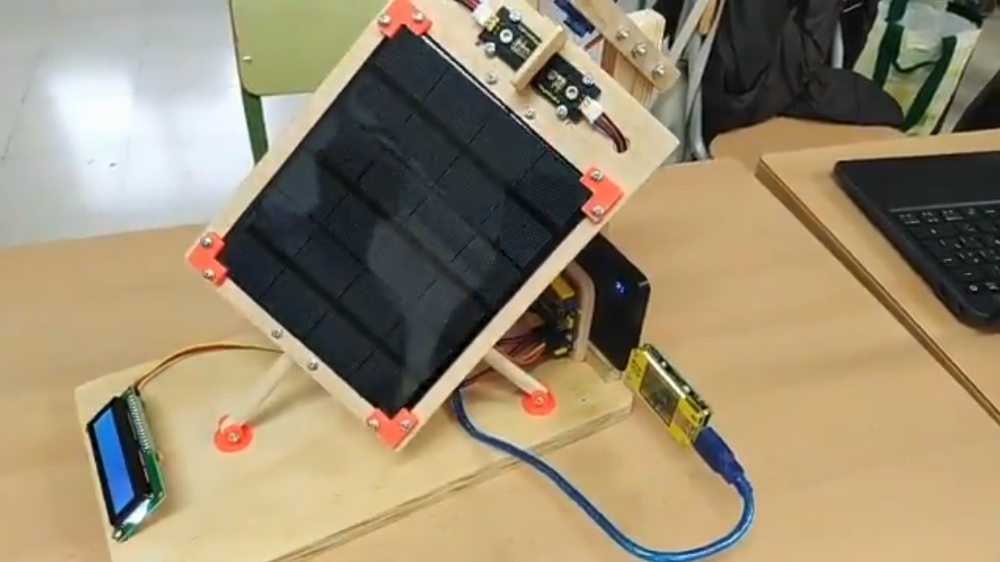
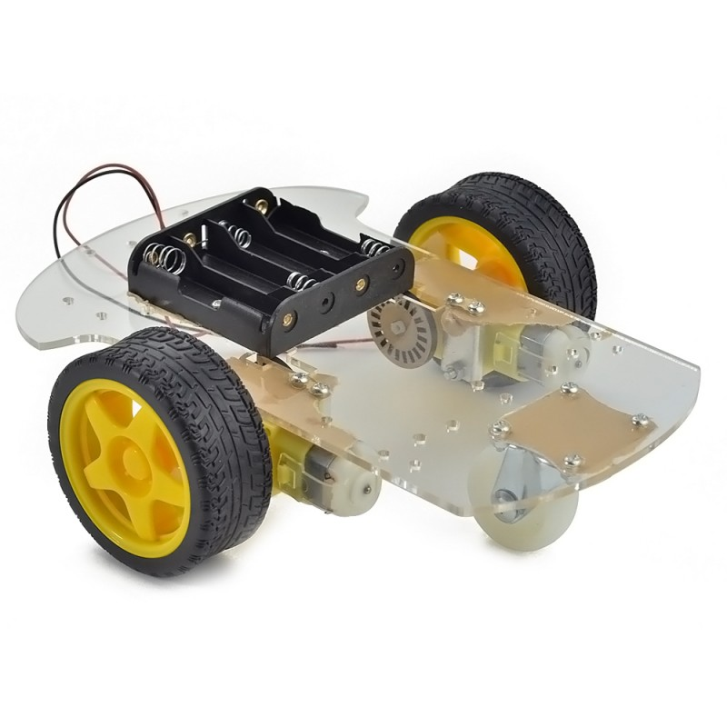
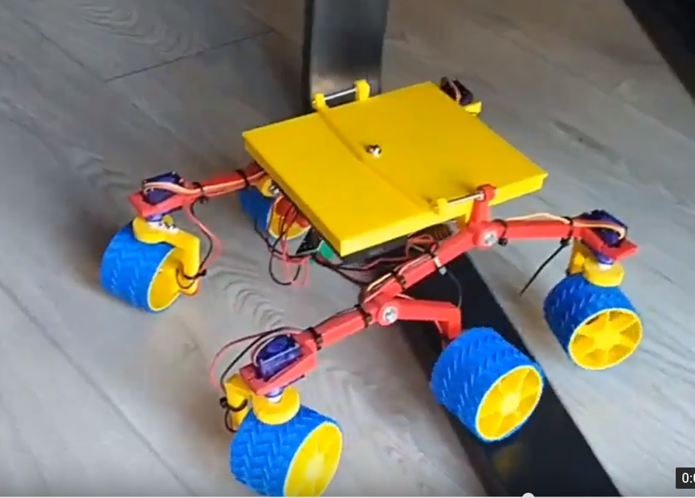

# Aprendizaje activo y significativo en aulas STEM
## Fomenta el pensamiento STEM haciendo robótica con Arduino

Universidad Internacional Menendez y Pelayo (UIMP)

### José Antonio Vacas Martínez @javacasm

### https://github.com/javacasm/STEAMArduinoUIMP

## ¿qué es STEM?

Para mi es HACER, construir, calcular, controlar

¿componente que nos permite esto? un ordenador, mejor un microordenador, mejor todavía un microcontrolador

Veamos algunos ejemplos ¿Qué proyecto nos gustaría montar?

## Ejemplos de proyectos

Robotica, domótica, drones

Todos proyectos que suenan

Podemos descargar instrucciones para hacerlos desde internet

Para mi el enfoque STEM consiste en una nueva forma de ver estos proyectos, más profunda que no se queda en el montaje

TODO: Rollo del cohete

##  ¿qué necesitamos?

En primer lugar vamos a hablar del rey de los microcontroladores: ARDUINO

TODO: Imagen arduino

(No es el mejor, no es el más barato, ni el más rápido, ni el más fácil de usar)

Pero sí es el que ha permitido que millones de personas consigan hacer lo que antes sólo hacían los ingenieros

Arduino es:
* Una placa
* Un entorno de programación, con sus librerías y ejemplos
* Una documentación

TODO Open Source

TODO: imagen open source 

Se creó en [2005](https://es.wikipedia.org/wiki/Arduino) y desde entonces no ha parado de evolucionar, mejorar, crear derivados y dar lugar a una industria enorme

### Física
Planos inclinados, cinemática, comprobación de leyes fisicas

Experimentos sobre calidad de las medidas: precisión, exactitud, errores en la medida, estadística, ...

#### Física del spinner
conceptos: velocidades, momento angular
estudiar como influye el momento de inercia en el movimiento

#### Comparación de conductividad térmica o cómo explicar las excesivas temperatura de los termómetros callejeros

* sensores de temperatura fijados en una chapa metálica, un plástico y un ladrillo o similar
* sensor que mide la temperatura a la sombra
* ponemos al sol las fijaciones y comparamos la temperatura

#### Medidas de conductividad eléctrica en disoluciones

Usamos un sensor de temperatura para medir la conductividad de distintas disoluciones

### Ingeniería
Domótica, estructuras, sensores

[Tunel de viento](https://www.instructables.com/id/DIY-Wind-Tunnel-and-Visualized-Airstreams-for-the-/)

### Química

Medida de valores físicos (temperatura, presión, color, ph, ... ) durante las reacciones

https://www.instructables.com/id/DIY-LED-photometer-With-Arduino-for-Physics-or-Che/

### Monitorización de paneles solares

Midiendo voltajes, intensidades, potencia y calculando eficiencias/voste

[Ejemplo](https://twitter.com/ToniMorenoRey/status/1125821060836941826)

### Robot móvil (cochecito)

Podemos medir el consumo eléctrico en circuito y trabajar temas de energía, trabajo.

Hacer un simulador: el coche fijo y podemos ajustar el rozamiento y medimos lo que le dura y la carga

En lugar de usar el típico cochecito...

Algo que inspire más

### planetas  extrasolares
Medida de cambio de luminosidad

## Herramientas

### Circuitos y módulos

TODO: imágenes de componentes

### Programación

ArduinoBlocks

tinkercad (simulador)

## Ejemplos de proyectos STEM para otros dispositivos

### Experimentos científicos con micro:bit

* [Recolección de datos](https://makecode.microbit.org/courses/ucp-science/data-collection)
* [Tratamiento de datos](https://makecode.microbit.org/courses/ucp-science/population)
* [Medidas de Temperatura](https://makecode.microbit.org/courses/ucp-science/temperature)
* [Comprobación de la humedad del suelo](https://makecode.microbit.org/courses/ucp-science/soil-moisture)
* [Gravedad, movimiento y  ondas](https://makecode.microbit.org/courses/ucp-science/gravity)
* [Conductividad del cuerpo](https://makecode.microbit.org/courses/ucp-science/electricity)
* [Electricidad y comprobador de baterías](https://makecode.microbit.org/courses/ucp-science/electricity)
* [Aceleración de cohetes](https://makecode.microbit.org/courses/ucp-science/rocket-acceleration)

https://makecode.microbit.org/courses/ucp-science  

## Recursos

https://aprendiendoarduino.wordpress.com/2018/05/06/arduino-en-la-educacion/

https://aprendiendoarduino.wordpress.com/2018/05/07/ejemplo-de-itinerario-educativo/

https://aprendiendoarduino.wordpress.com/2019/06/30/saber-mas-gestion-de-proyectos-con-arduino/

