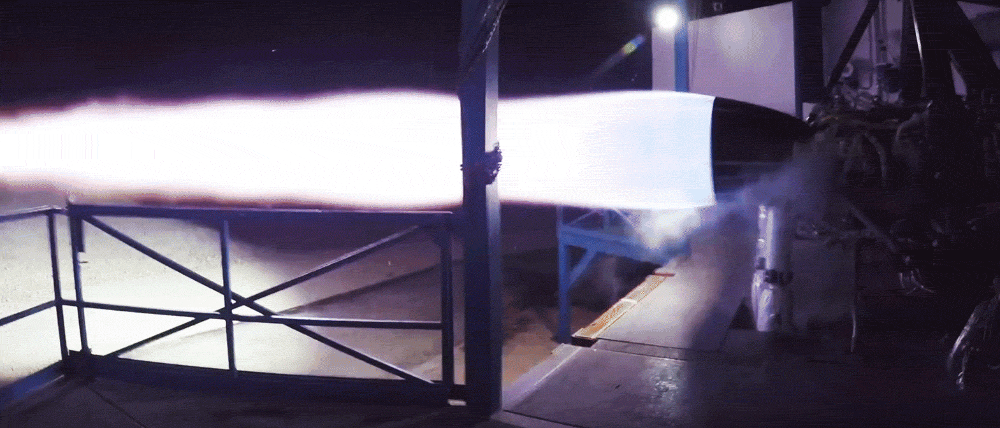

# Aprendizaje activo y significativo en aulas STEM
## Fomenta el pensamiento STEM haciendo robótica con Arduino
### Y con 3D y con micro:bit ....

### Universidad Internacional Menendez y Pelayo (UIMP)

### José Antonio Vacas Martínez @javacasm

### http://bit.ly/STEMUIMP

## ¿Qué es para mi STEM?

### Para mi es HACER, construir, calcular, controlar

### ¿Qué nos permite hacer y contruir?

### El [Diseño 3D](https://github.com/javacasm/3DCiencias19/blob/master/Disenio3D.md)

### ... y las [impresoras 3D](https://github.com/javacasm/3DCiencias19)

### Es calcular...

#### Enseñarles a calcular

#### ¿cuántos Kg CO2 nos "cuesta" un curso de verano si todos venimos en avión? ¿y si venimos en coche?
[Guía práctica para el cálculo de emisiones](http://www.caib.es/sacmicrofront/archivopub.do?ctrl=MCRST234ZI97531&id=97531)

(340Kg vs 297Kg en mi caso)

### Enseñarles a medir

#### ¿a qué temperatura sale el agua de la ducha del hotel?

Como ejercicio un sencillo termómetro programado con @ArduinoBlocks donde usábamos un sensor de temperatura estanco DS18b20 con el que he medido la temperatura del agua fría y caliente del hotel. Resultado: 23,44º y 64.25º
!
El proyecto que hemos usado es http://www.arduinoblocks.com/web/project/155842

### ¿Qué componente nos permite controlar? 

#### un ordenador, 
#### mejor un microordenador, 
#### mejor todavía un microcontrolador

### Veamos algunos ejemplos ¿Qué proyecto nos gustaría montar?

### Ejemplos de proyectos

* Robótica, 
* Domótica, 
* Drones

### Todos proyectos que suenan

### Podemos descargar instrucciones para hacerlos desde internet

### Pero ....

## El enfoque STEM es una nueva forma de ver estos proyectos, 
## más profunda ...
## que no se queda en el montaje

### Un ejemplo: cohetes de agua

### ¿Y si lo fotografiamos a cámara lenta con lentes polarizadas?

[cohete de agua a cámara lenta](https://twitter.com/ciencia__infusa/status/1148528045835399169)

### Que nos recuerda a ....

## Si les enseñas un robot querrán hacerlo, enséñales un cohete espacial y no límites sus sueños 

##  ¿Qué necesitamos?

## El rey de los microcontroladores: ARDUINO

### No es el mejor, 
### no es el más barato, 
### ni el más rápido, 
### ni el más fácil de usar

## Ha permitido que millones de personas consigan hacer lo que antes sólo hacían los ingenieros

### Arduino es:
* Una placa
* Un entorno de programación, con sus librerías y ejemplos
* Una documentación

## TODO Open Source

### Se creó en [2005](https://es.wikipedia.org/wiki/Arduino) 
### Desde entonces no ha parado de 
* evolucionar, 
* mejorar, 
* crear derivados 
* abaratarse 
* y dar lugar a una industria enorme

## Ideas de proyectos vistos como STEM

### Física

[Planos inclinados, cinemática](http://www.iesveleta.com/actividades/proyecto-educativo-con-robots-cinematica-con-arduino/), comprobación de leyes fisicas

Experimentos sobre calidad de las medidas: precisión, exactitud, errores en la medida, estadística, ...

### [Física del spinner](https://github.com/javacasm/Spinners)

Conceptos: 
* velocidad, 
* momento angular
* momento de inercia

##### Estudiamos como influye el momento de inercia en el movimiento

#### Diseñando

#### Controlando

#### Midiendo

#### Comparación de conductividad térmica o cómo explicar las excesivas temperatura de los termómetros callejeros

* sensores de temperatura fijados en una chapa metálica, un plástico y un ladrillo o similar
* sensor que mide la temperatura a la sombra
* ponemos al sol las fijaciones y comparamos la temperatura

#### Medidas de conductividad eléctrica en disoluciones

Usamos un sensor de temperatura para medir la conductividad de distintas disoluciones

### Ingeniería
Domótica, estructuras, sensores

[Tunel de viento](https://www.instructables.com/id/DIY-Wind-Tunnel-and-Visualized-Airstreams-for-the-/)

### Química

Medida de valores físicos (temperatura, presión, color, ph, ... ) durante las reacciones

https://www.instructables.com/id/DIY-LED-photometer-With-Arduino-for-Physics-or-Che/

### Monitorización de paneles solares

Midiendo voltajes, intensidades, potencia y calculando eficiencias/voste

[Ejemplo](https://twitter.com/ToniMorenoRey/status/1125821060836941826)

### Robot móvil (cochecito)

Podemos medir el consumo eléctrico en circuito y trabajar temas de energía, trabajo.

Hacer un simulador: el coche fijo y podemos ajustar el rozamiento y medimos lo que le dura y la carga

En lugar de usar el típico cochecito...

Algo que inspire más

### Detección de planetas  extrasolares

Medida de cambio de luminosidad o método del tránsito

## Herramientas

### [Circuitos y módulos](./Componentes.md)

Podemos usar módulos que vienen preparados para conectar, sin tener que soldarlos

### Programación

### [ ArduinoBlocks](http://arduinoblocks.comprobador)

### [Tinkercad crcuits](https://www.tinkercad.com/dashboard?type=circuits&collection=designs) (incluye simulador)

## Ejemplos de proyectos STEM para otros dispositivos

### Experimentos científicos con micro:bit

* [Recolección de datos](https://makecode.microbit.org/courses/ucp-science/data-collection)
* [Tratamiento de datos](https://makecode.microbit.org/courses/ucp-science/population)
* [Medidas de Temperatura](https://makecode.microbit.org/courses/ucp-science/temperature)
* [Comprobación de la humedad del suelo](https://makecode.microbit.org/courses/ucp-science/soil-moisture)
* [Gravedad, movimiento y  ondas](https://makecode.microbit.org/courses/ucp-science/gravity)
* [Conductividad del cuerpo](https://makecode.microbit.org/courses/ucp-science/electricity)
* [Electricidad y comprobador de baterías](https://makecode.microbit.org/courses/ucp-science/electricity)
* [Aceleración de cohetes](https://makecode.microbit.org/courses/ucp-science/rocket-acceleration)

https://makecode.microbit.org/courses/ucp-science  

## Recursos

https://aprendiendoarduino.wordpress.com/2018/05/06/arduino-en-la-educacion/

https://aprendiendoarduino.wordpress.com/2018/05/07/ejemplo-de-itinerario-educativo/

https://aprendiendoarduino.wordpress.com/2019/06/30/saber-mas-gestion-de-proyectos-con-arduino/

